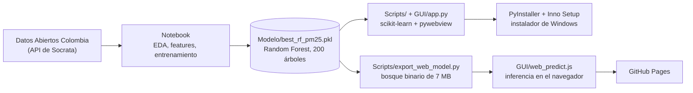

# AirAMB: pronóstico horario de PM2.5 en Bucaramanga, Colombia

[English](README.md) · **Español**

[](https://saulo1112.github.io/AirAMB/?lang=es)
[](https://github.com/saulo1112/AirAMB/actions/workflows/ci.yml)
[](LICENSE)


AirAMB predice la **concentración de PM2.5 una hora hacia adelante (t+1)** en la estación de calidad del aire Santa Cruz - Girón Norte, en Bucaramanga (Colombia), a partir de las últimas lecturas de PM2.5 y PM10 y de variables meteorológicas y de calendario. Es el proyecto final del curso *Aprendizaje Automático*, Especialización en Inteligencia Artificial, Universidad Autónoma de Occidente (UAO), 2025-2S.

El repositorio cubre todo el recorrido, desde los datos abiertos hasta un producto utilizable: extracción de datos, análisis exploratorio, comparación de modelos y **dos formas de usar el modelo entrenado**: una aplicación web en GitHub Pages y un instalador de escritorio para Windows.


## Dos despliegues

La misma interfaz (`GUI/index.html`) se entrega de dos maneras:

| | Aplicación web (GitHub Pages) | Aplicación de escritorio (instalador de Inno Setup) |
|---|---|---|
| Dónde | <https://saulo1112.github.io/AirAMB/?lang=es> | Página de [Releases](https://github.com/saulo1112/AirAMB/releases) |
| Instalación | Ninguna, se abre en el navegador | Ejecutar el instalador `.exe` (Windows x64) |
| Dónde corre el modelo | En el navegador, en JavaScript | En local, en Python (scikit-learn) |
| Reporte PDF | Lo descarga el navegador (jsPDF) | Se guarda en `Documents/AirAMB_Reportes`, dentro de la carpeta del usuario (ReportLab) |
| Idioma | Inglés y español, intercambiables | **Solo en español por ahora** |

Las dos dan las mismas predicciones: la versión web evalúa el mismo bosque de 200 árboles, exportado desde el pickle, y se comparó con scikit-learn sobre 300 entradas aleatorias (diferencia máxima de cerca de 1e-6 µg/m³).

Windows puede mostrar una advertencia de SmartScreen al ejecutar el instalador, porque no está firmado digitalmente.

## Resultados

El modelo desplegado es un Random Forest Regressor (200 árboles). Los datos vienen del portal de datos abiertos de Colombia (Datos Abiertos Colombia, API de Socrata). La partición es cronológica para evitar fuga de información, y Random Forest se comparó con AdaBoost y regresión Ridge con un esquema de validación que respeta el orden temporal.

| Random Forest | RMSE (µg/m³) | MAE (µg/m³) | R² |
|---|---|---|---|
| Entrenamiento | 1.422 | 0.835 | 0.989 |
| Prueba | 3.716 | 2.213 | 0.960 |

El entrenamiento tardó cerca de 33.6 s y una predicción 0.15 s en el equipo de los autores: es el más lento de los tres modelos, pero sigue siendo instantáneo para una aplicación interactiva. La comparación completa, con la discusión de cada modelo, está en el [paper](Documentos/Paper%20-%20Grupo%203.pdf) (en inglés).

## Cómo encaja todo



**Entradas.** El usuario ingresa 17 valores: PM2.5 y PM10 actuales, tres rezagos (t-1, t-2, t-3) de cada uno, hora del día, día de la semana, mes y seis variables meteorológicas (precipitación, radiación solar, velocidad y dirección del viento, humedad relativa, temperatura ambiente). La hora y el día de la semana se convierten en pares seno/coseno, así que el modelo recibe 21 variables.

**Versión web.** El pickle pesa 176 MB, demasiado para GitHub y para un navegador. `Scripts/export_web_model.py` reescribe cada árbol en arreglos planos tipados (índice de variable, desplazamiento al hijo derecho, umbral o valor de hoja), comprimidos con gzip a cerca de 7 MB, sin podar ni reentrenar. `GUI/web_predict.js` lo descarga una vez y recorre los árboles; también porta la validación de entradas, la ingeniería de variables y el reporte PDF.

**Versión de escritorio.** `Scripts/main_pm25.py` abre `GUI/index.html` en una ventana nativa con [pywebview](https://pywebview.flowrl.com/). Cuando existe `window.pywebview`, la página llama al backend de Python (`GUI/app.py`) en lugar del de JavaScript. PyInstaller empaqueta todo en un solo `AirAMB.exe` e Inno Setup lo envuelve en un instalador.

## Interfaz bilingüe

La página elige el idioma, en este orden, según: el parámetro `?lang=` (`?lang=es`), la opción guardada en el navegador y el idioma del navegador. El selector **EN / ES** del encabezado lo cambia en cualquier momento, incluidas las etiquetas, los mensajes de validación y el texto del reporte PDF.

Todos los textos están en [`GUI/i18n.js`](GUI/i18n.js). Para añadir un idioma, agrega una entrada con las mismas claves que `en` y un botón con `data-lang` en `index.html`; `tests/i18n.test.js` falla si falta una clave o un marcador. La tabla de referencia que se imprime en el PDF es la oficial de la Resolución 2254 de 2017 de Colombia, que solo se publica en español.

## Estructura del repositorio

Algunas carpetas conservan su nombre en español (`Modelo`, `Documentos`) porque los scripts de compilación y el instalador las referencian.

```
.
├── Notebook/            Notebook: extracción, EDA, variables, entrenamiento, evaluación
├── Modelo/              Modelo entrenado (best_rf_pm25.pkl), no versionado en Git (176 MB)
├── Scripts/             Pipeline de inferencia compartido con la app de escritorio
│   ├── config.py            Nombre de la app y rutas de recursos (dev / PyInstaller)
│   ├── features_pm25.py     Construye el vector de variables del modelo desde las entradas
│   ├── validation_pm25.py   Validación y conversión de tipos de las entradas
│   ├── predict_pm25.py      Carga el modelo y ejecuta la inferencia
│   ├── export_web_model.py  Convierte el pickle al formato compacto de la app web
│   └── main_pm25.py         Punto de entrada de escritorio
├── GUI/                 La interfaz (la sirve GitHub Pages y se empaqueta en el .exe)
│   ├── index.html, style.css, Assets/
│   ├── i18n.js              Textos en inglés y español
│   ├── web_predict.js       Backend del navegador: validación, bosque, PDF
│   ├── model/               Bosque exportado para el navegador (generado)
│   └── app.py               Backend de escritorio (pywebview): predicción y PDF
├── Inno Setup/          Script del instalador y texto de la licencia
├── tests/               Pruebas con pytest (Python) y node:test (JavaScript)
├── docs/images/         Capturas usadas en este README
├── Documentos/          Paper y diapositivas (PDF)
├── Logo/                Ícono de la aplicación
└── .github/workflows/   pages.yml (despliega GUI/), ci.yml (ejecuta las pruebas)
```

## Cómo ejecutarlo

### Aplicación web, en local

Abrir `index.html` con doble clic no funciona, porque los navegadores bloquean `fetch` sobre `file://`. Sirve la carpeta en su lugar:

```bash
python -m http.server 8000 --directory GUI
```

y abre <http://localhost:8000>.

El workflow `.github/workflows/pages.yml` publica `GUI/` en cada push a `main` que la modifique. Hay que activarlo una sola vez en Settings → Pages → Source: **GitHub Actions**.

### Aplicación de escritorio, desde el código

Las versiones de `requirements.txt` coinciden con las usadas al guardar el modelo (scikit-learn 1.6.1, numpy 2.x). Cargar el pickle con numpy menor a 2.0 falla con `ModuleNotFoundError: No module named 'numpy._core'`, por eso se recomienda un entorno dedicado:

```bash
conda create -n airamb python=3.10 -y
conda activate airamb
pip install -r requirements.txt
python Scripts/main_pm25.py
```

Requiere `Modelo/best_rf_pm25.pkl`, que no está en el repositorio (ver más abajo).

### Compilar el instalador

Desde el entorno `airamb`, con el `Library/bin` de conda al inicio del `PATH` (si no, PyInstaller omite `ffi.dll`, `tcl86t.dll` y otras, y el ejecutable falla con `ImportError: DLL load failed while importing _ctypes`):

```bat
set PATH=%CONDA_PREFIX%\Library\bin;%PATH%
pyinstaller --name AirAMB --onefile --icon "Logo/AirAMB_Logo.ico" --add-data "GUI;GUI" --add-data "Modelo;Modelo" Scripts/main_pm25.py
```

Luego compila `Inno Setup/App script.iss` con el compilador de [Inno Setup](https://jrsoftware.org/isinfo.php) (`ISCC.exe`). Lee `dist/AirAMB.exe` y escribe `Ejecutable/AirAMB_Setup.exe`. El instalador se publica en un Release de GitHub, no en el repositorio.

### Pruebas

```bash
pip install numpy pandas pytest
python -m pytest                    # validación e ingeniería de variables
node --test tests/*.test.js         # traducciones y validación en JavaScript
```

Los casos de validación están en un solo archivo, `tests/validation_cases.json`, que usan ambas suites, así que las implementaciones de Python y de JavaScript cumplen las mismas reglas.

## Cómo obtener el modelo entrenado

`Modelo/best_rf_pm25.pkl` (176 MB) supera el límite de 100 MB por archivo de GitHub y está en `.gitignore`. Para obtenerlo, vuelve a ejecutar el notebook o pídele el archivo a los autores. Si reentrenas, ejecuta después `python Scripts/export_web_model.py` para actualizar `GUI/model/`.

## Documentación

- [Notebook](Notebook/Proyecto_%28ML%29_Grupo_2.ipynb): extracción de datos, EDA, ingeniería de variables, comparación de modelos y verificación de predicciones individuales contra observaciones reales.
- [Paper](Documentos/Paper%20-%20Grupo%203.pdf) y [diapositivas](Documentos/Proyecto%20ML%20-%20Diapositivas.pdf).

## Limitaciones

- Una estación y un modelo. No se admiten predicciones para otros lugares ni contaminantes.
- La aplicación no lee datos en vivo: el usuario escribe los valores de las últimas horas.
- Es un proyecto de curso, no un servicio oficial de calidad del aire. No debe usarse para decisiones de salud.

## Autores

- Jorman Alexis Muñoz Anacona
- Saulo Quiñones Góngora
- Adrian Felipe Vargas Rojas
- Luis David Hurtado Caicedo
- Manuel Castillo Rosales

Docente: Juan Camilo Giraldo Londoño

## Licencia

[MIT](LICENSE).
