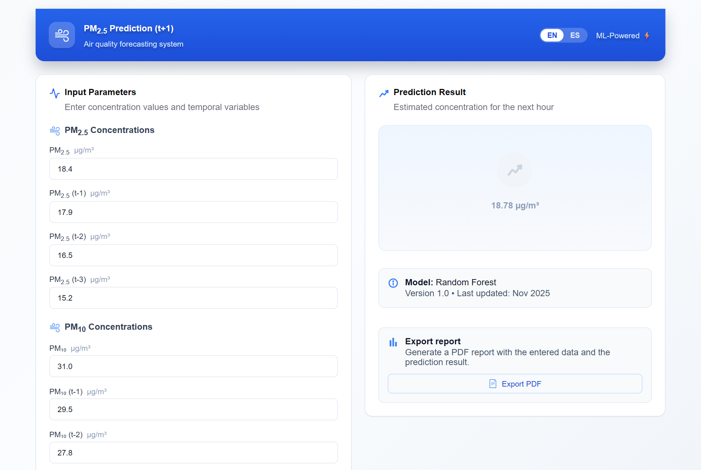
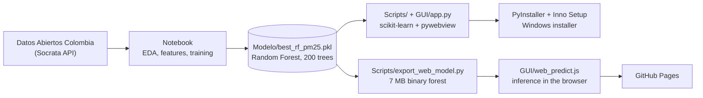

# AirAMB: hourly PM2.5 forecasting in Bucaramanga, Colombia

**English** · [Español](README.es.md)

[](https://saulo1112.github.io/AirAMB/)
[](https://github.com/saulo1112/AirAMB/actions/workflows/ci.yml)
[](LICENSE)


AirAMB predicts the **PM2.5 concentration one hour ahead (t+1)** at the Santa Cruz - Girón Norte air-quality station in Bucaramanga, Colombia, from the last readings of PM2.5 and PM10 and from meteorological and calendar variables. It is the final project of the course *Aprendizaje Automático* (Machine Learning), Specialization in Artificial Intelligence, Universidad Autónoma de Occidente (UAO), 2025-2S.

The repository covers the whole path from raw open data to a usable product: data extraction, exploratory analysis, model comparison, and **two ways of using the trained model**: a web app on GitHub Pages and a Windows desktop installer.



## Two deployments

The same interface (`GUI/index.html`) is shipped in two ways:

| | Web app (GitHub Pages) | Windows desktop app (Inno Setup installer) |
|---|---|---|
| Where | <https://saulo1112.github.io/AirAMB/> | [Releases](https://github.com/saulo1112/AirAMB/releases) page |
| Install | Nothing, it opens in the browser | Run the `.exe` installer (Windows x64) |
| Where the model runs | In the browser, in JavaScript | Locally, in Python (scikit-learn) |
| PDF report | Downloaded by the browser (jsPDF) | Saved to `Documents/AirAMB_Reportes` (ReportLab) |
| Language | English and Spanish, switchable | **Spanish only for now** |

Both give the same predictions: the web version evaluates the same 200-tree forest, exported from the pickle, and was checked against scikit-learn on 300 random inputs (largest difference about 1e-6 µg/m³).

Windows may show a SmartScreen warning when running the installer, because it is not code-signed.

## Results

The deployed model is a Random Forest Regressor (200 trees). The data come from Colombia's open data portal (Datos Abiertos Colombia, Socrata API). The split is chronological to avoid leakage, and Random Forest was compared with AdaBoost and Ridge regression under a time-aware validation scheme.

| Random Forest | RMSE (µg/m³) | MAE (µg/m³) | R² |
|---|---|---|---|
| Train | 1.422 | 0.835 | 0.989 |
| Test | 3.716 | 2.213 | 0.960 |

Training took about 33.6 s and a prediction 0.15 s on the authors' machine, which is the slowest of the three models but still instant for an interactive app. The full comparison, with the discussion of each model, is in the [paper](Documentos/Paper%20-%20Grupo%203.pdf).

## How it fits together



**Inputs.** The user enters 17 values: current PM2.5 and PM10, three lags (t-1, t-2, t-3) of each, hour of day, day of week, month, and six meteorological variables (precipitation, solar radiation, wind speed and direction, relative humidity, ambient temperature). Hour and day of week are expanded into sine/cosine pairs, so the model receives 21 features.

**Web version.** The pickle is 176 MB, too big for GitHub and for a browser. `Scripts/export_web_model.py` rewrites every tree into flat typed arrays (feature index, right-child offset, threshold or leaf value), gzipped to about 7 MB, with no pruning and no retraining. `GUI/web_predict.js` downloads it once and walks the trees; it also ports the input validation, the feature engineering and the PDF report.

**Desktop version.** `Scripts/main_pm25.py` opens `GUI/index.html` in a native window with [pywebview](https://pywebview.flowrl.com/). The page calls the Python backend (`GUI/app.py`) instead of the JavaScript one when `window.pywebview` exists. PyInstaller packs everything into one `AirAMB.exe` and Inno Setup wraps it in an installer.

## Bilingual interface

The page picks its language from, in order: the `?lang=` parameter (`?lang=es`), the choice saved in the browser, and the browser language. The **EN / ES** switch in the header changes it at any time, including the labels, validation messages and the text of the PDF report.

All strings live in [`GUI/i18n.js`](GUI/i18n.js). To add a language, add an entry with the same keys as `en` and a button with `data-lang` in `index.html`; `tests/i18n.test.js` fails if a key or placeholder is missing. The reference table printed in the PDF is the official one from Colombian Resolution 2254 of 2017, which is published in Spanish only.

## Repository structure

Some folders keep their Spanish names (`Modelo`, `Documentos`) because the build scripts and the installer refer to them.

```
.
├── Notebook/            Jupyter notebook: extraction, EDA, features, training, evaluation
├── Modelo/              Trained model (best_rf_pm25.pkl), not tracked in Git (176 MB)
├── Scripts/             Inference pipeline shared by the desktop app
│   ├── config.py            App name and resource paths (dev / PyInstaller)
│   ├── features_pm25.py     Builds the model's feature vector from the raw inputs
│   ├── validation_pm25.py   Input validation and casting
│   ├── predict_pm25.py      Loads the model and runs inference
│   ├── export_web_model.py  Converts the pickle into the compact format used by the web app
│   └── main_pm25.py         Desktop entry point
├── GUI/                 The interface (served by GitHub Pages and packed into the .exe)
│   ├── index.html, style.css, Assets/
│   ├── i18n.js              English / Spanish strings
│   ├── web_predict.js       Browser backend: validation, forest inference, PDF
│   ├── model/               Forest exported for the browser (generated)
│   └── app.py               Desktop backend (pywebview): prediction and PDF
├── Inno Setup/          Installer script and license text
├── tests/               pytest (Python) and node:test (JavaScript) suites
├── docs/images/         Screenshots used in this README
├── Documentos/          Paper and slides (PDF)
├── Logo/                Application icon
└── .github/workflows/   pages.yml (deploys GUI/), ci.yml (runs the tests)
```

## Running it

### Web app, locally

Opening `index.html` by double click does not work, since browsers block `fetch` on `file://`. Serve the folder instead:

```bash
python -m http.server 8000 --directory GUI
```

then open <http://localhost:8000>.

The workflow `.github/workflows/pages.yml` publishes `GUI/` on every push to `main` that touches it. It needs to be enabled once under Settings → Pages → Source: **GitHub Actions**.

### Desktop app, from source

The versions in `requirements.txt` match the ones used to pickle the model (scikit-learn 1.6.1, numpy 2.x). Loading the pickle with numpy below 2.0 fails with `ModuleNotFoundError: No module named 'numpy._core'`, so a dedicated environment is recommended:

```bash
conda create -n airamb python=3.10 -y
conda activate airamb
pip install -r requirements.txt
python Scripts/main_pm25.py
```

This needs `Modelo/best_rf_pm25.pkl`, which is not in the repository (see below).

### Building the installer

From the `airamb` environment, with conda's `Library/bin` first on `PATH` (PyInstaller otherwise misses `ffi.dll`, `tcl86t.dll` and others, and the executable fails with `ImportError: DLL load failed while importing _ctypes`):

```bat
set PATH=%CONDA_PREFIX%\Library\bin;%PATH%
pyinstaller --name AirAMB --onefile --icon "Logo/AirAMB_Logo.ico" --add-data "GUI;GUI" --add-data "Modelo;Modelo" Scripts/main_pm25.py
```

Then compile `Inno Setup/App script.iss` with the [Inno Setup](https://jrsoftware.org/isinfo.php) compiler (`ISCC.exe`). It reads `dist/AirAMB.exe` and writes `Ejecutable/AirAMB_Setup.exe`. The installer goes in a GitHub Release, not in the repository.

### Tests

```bash
pip install numpy pandas pytest
python -m pytest                    # validation and feature engineering
node --test tests/*.test.js         # translations and the JavaScript validation
```

The validation cases are in one file, `tests/validation_cases.json`, used by both suites, so the Python and JavaScript implementations are held to the same rules.

## Obtaining the trained model

`Modelo/best_rf_pm25.pkl` (176 MB) is above GitHub's 100 MB file limit and is listed in `.gitignore`. To get it, re-run the notebook or ask the authors for the file. If you retrain, run `python Scripts/export_web_model.py` afterwards to refresh `GUI/model/`.

## Documentation

- [Notebook](Notebook/Proyecto_%28ML%29_Grupo_2.ipynb): data extraction, EDA, feature engineering, model comparison, and a check of individual predictions against real observations.
- [Paper](Documentos/Paper%20-%20Grupo%203.pdf) and [slides](Documentos/Proyecto%20ML%20-%20Diapositivas.pdf).

## Limitations

- One station and one model. Predictions for other places or pollutants are not supported.
- The app does not read live data: the user types the last hours' values.
- This is a course project, not an official air-quality service. Do not use it for health decisions.

## Authors

- Jorman Alexis Muñoz Anacona
- Saulo Quiñones Góngora
- Adrian Felipe Vargas Rojas
- Luis David Hurtado Caicedo
- Manuel Castillo Rosales

Instructor: Juan Camilo Giraldo Londoño

## License

[MIT](LICENSE).
